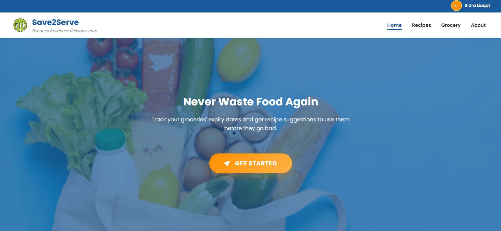
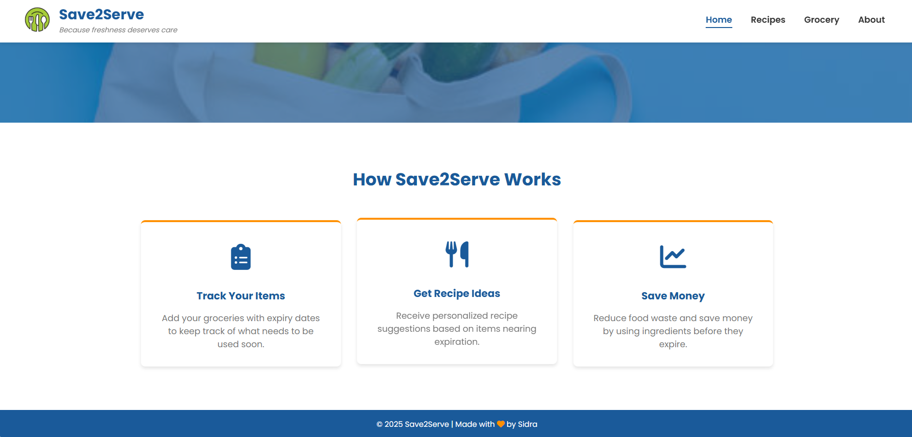
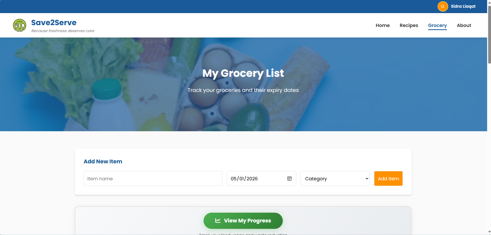
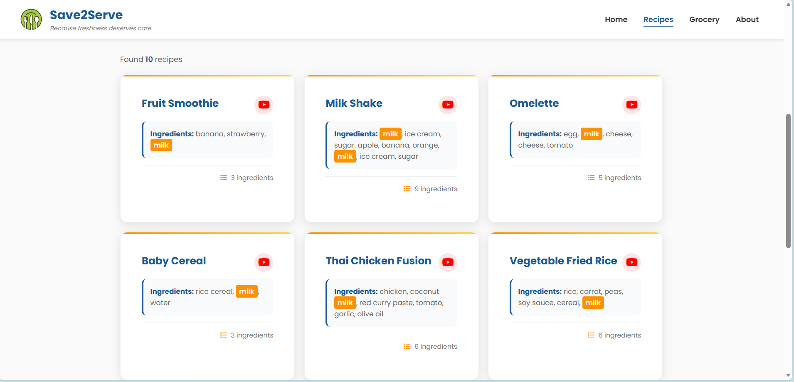
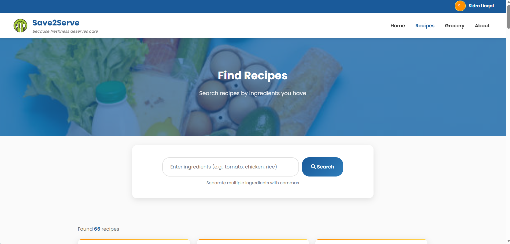
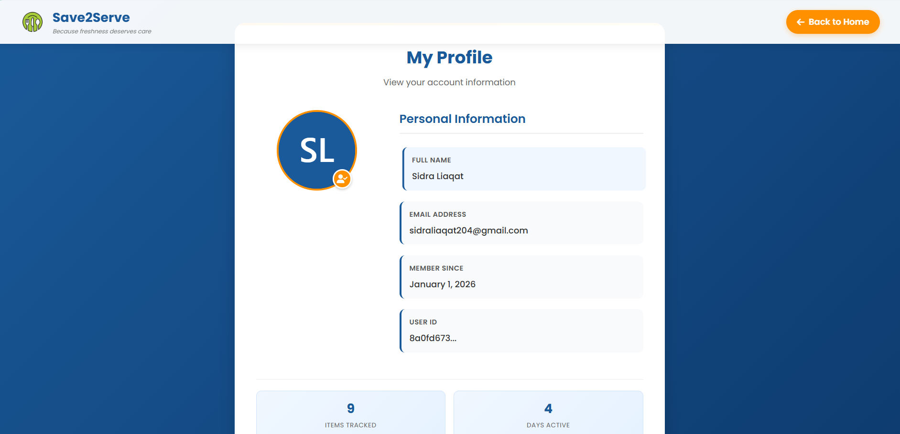
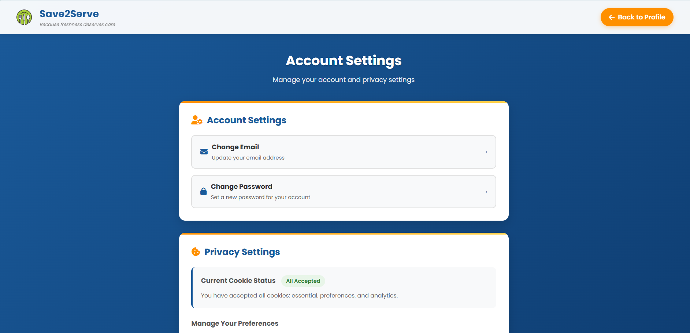
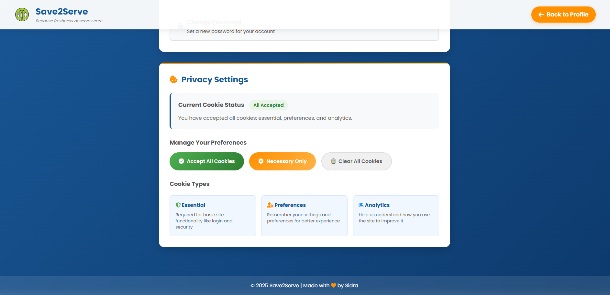
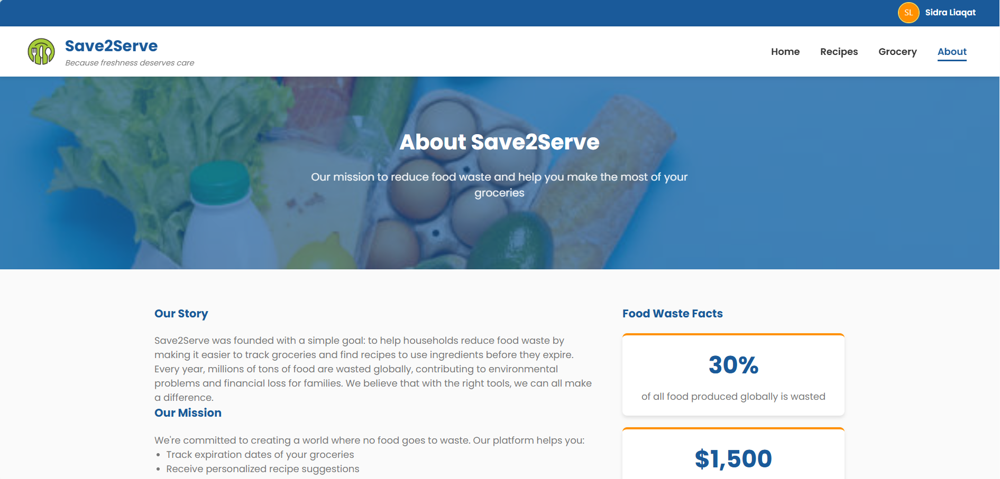
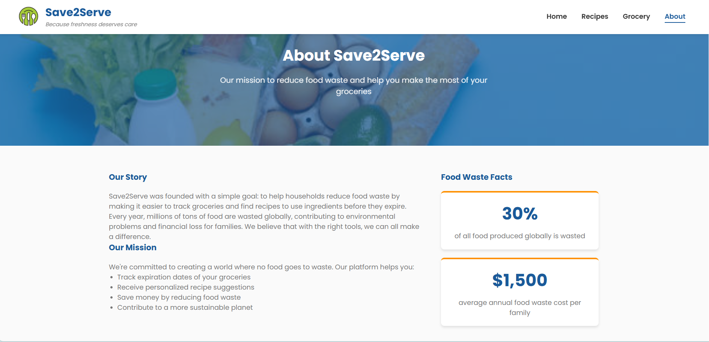

# Save2Serve – Food Recipe & Expiry Suggester

A user-friendly web application that helps users **discover recipes** based on available ingredients and **track food expiry dates** to reduce waste. Built with **HTML, CSS, and JavaScript**, and powered by **Supabase** for database management, it combines **convenience, health, and sustainability** in one platform. 🌱🍲

---

## Features

- Discover recipes using available ingredients  
- Track food expiry dates to reduce food waste  
- User-friendly, responsive, and mobile-friendly interface  
- Secure authentication & user profiles with **Supabase**  
- Visual analytics to track grocery usage and food consumption  

---

## Tech Stack

- **Frontend:** HTML, CSS, JavaScript  
- **Database & Authentication:** Supabase  
- **Hosting (optional):** GitHub Pages or Netlify  

---

## Screenshots

### Authentication & Login
  
  
  

### Home Page
  
  

### Grocery / Ingredients
  
  

### Recipes
  
  

### Profile & Settings
  
  
  

### About & Analytics
  
  
  

---

## How to Run Locally

Follow these steps to run the project on your local machine:

1. **Clone the repository**  
   ```bash
   git clone https://github.com/YourUsername/Save2Serve-WebApp.git
   cd Save2Serve-WebApp
